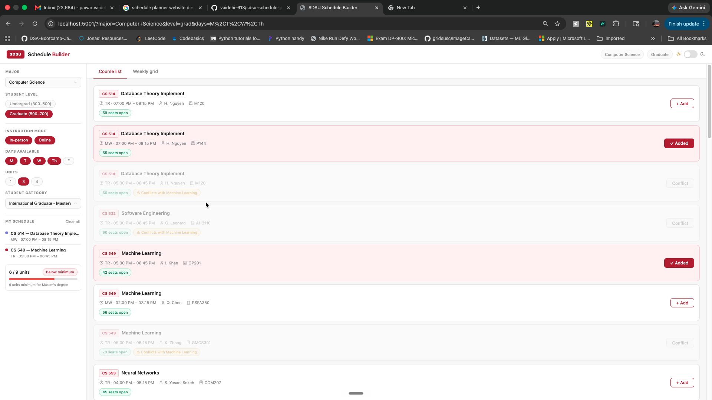
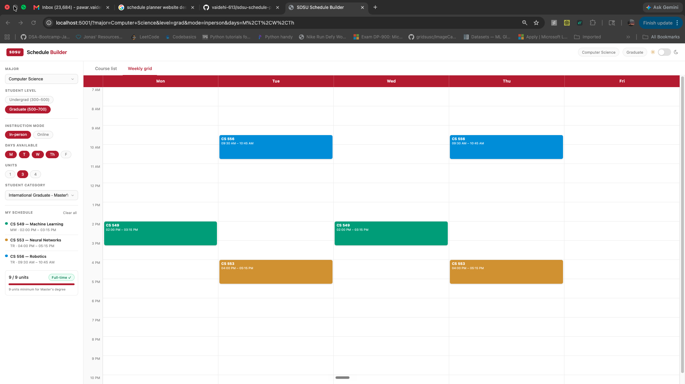

# SDSU Schedule Builder

> Vibe coded this entire project with Claude — every line of backend, frontend, conflict detection, weekly grid, and enrollment tracker was built through AI-assisted development, phase by phase, prompt by prompt.

A web app for **San Diego State University** students to browse the Fall 2026 class schedule, filter by major and student level, build a conflict-free personal schedule, and track enrollment unit requirements — all in one clean interface.

---

## Screenshots

### Course List — Light Mode


### Weekly Grid — Dark Mode


---

## Demo

📽️ [Watch the demo video](assets/demo.mov)

---

## Features

- **Course browser** — Filter 1,700+ Fall 2026 courses by major, student level, instruction mode, days available, and unit count
- **Real-time conflict detection** — Cards dim and show a warning chip the moment a time overlap is detected with your schedule
- **Weekly grid view** — Added courses appear as colored blocks on a Mon–Fri calendar, sized proportionally by duration
- **Enrollment unit tracker** — Tracks total units against minimum requirements for your student category (F-1/J-1 visa rules included)
- **My Schedule panel** — Color-coded sidebar list of added courses with days and times
- **Dark / light mode** — One-click toggle, instant repaint via CSS variables
- **URL sync** — Filters are reflected in the URL so you can share or bookmark a specific view
- **8 majors supported** — Astronomy, Biology, Chemistry, Computer Science, Geology, Math, Physics, Psychology

---

## Tech Stack

| Layer | Technology |
|---|---|
| Backend | Python · Flask · Flask-CORS |
| Data | CSV — SDSU Fall 2026 schedule (1,700+ rows) |
| Frontend | Vanilla HTML · CSS · JavaScript (zero frameworks) |
| Icons | Tabler Icons (CDN) |

---

## Getting Started

```bash
# 1. Clone the repo
git clone https://github.com/vaidehi-613/sdsu-schedule-planner.git
cd sdsu-schedule-planner

# 2. Install dependencies
pip install -r requirements.txt

# 3. Run the server
python app.py
```

Open **http://localhost:5001** in your browser.

> **Note:** macOS reserves port 5000 for AirPlay Receiver — this app runs on port 5001.

---

## Project Structure

```
my_app/
├── app.py                 # Flask backend — API routes + CSV parsing
├── requirements.txt
├── data/
│   └── fallSchedule.csv   # SDSU Fall 2026 schedule data
├── assets/
│   ├── ss1.png            # Screenshot — course list
│   ├── ss2.png            # Screenshot — weekly grid
│   └── demo.mov           # Demo video
├── static/
│   ├── style.css          # All styles, CSS variables, dark mode
│   └── app.js             # All frontend logic — filters, conflict detection, grid
└── templates/
    └── index.html         # Single-page app shell
```

---

## API Endpoints

### `GET /api/courses`
Returns filtered courses as JSON.

| Parameter | Required | Values |
|---|---|---|
| `major` | ✅ | `Computer Science`, `Biology`, etc. |
| `level` | ✅ | `grad` · `undergrad` |
| `mode` | — | `inperson` · `online` · `all` (default) |
| `days` | — | Comma-separated: `M,T,W,Th,F` |
| `units` | — | `1` · `3` · `4` |

### `GET /api/majors`
Returns the list of 8 supported majors.

---

## Enrollment Unit Requirements

| Student Category | Half-time | Full-time |
|---|---|---|
| International Undergraduate (F-1/J-1) | — | **12 units** (strict visa requirement) |
| Domestic Undergraduate | 6 | 12 |
| International Graduate – Master's (F-1/J-1) | — | **9 units** |
| International Graduate – Doctoral (F-1/J-1) | — | **6 units** |
| Domestic Graduate | 5 | 9 |

International students have no half-time state — F-1/J-1 visa rules require full-time enrollment.

---

## Conflict Detection

Two courses conflict if they share at least one common day **and** their time ranges overlap:

```
conflict = daysOverlap(A, B)  AND  A.start < B.end  AND  B.start < A.end
```

- Thursday is stored as `R` in the CSV — normalized to `Th` internally to prevent false matches with `ARR` (arranged schedule) patterns
- Async / online courses with no meeting time never conflict with anything
- Courses already added to My Schedule continue to participate in conflict detection even when filtered out of the current view

---

## Build Phases

| Phase | What was built |
|---|---|
| 1 | Flask backend — data loading, CSV filtering, API endpoints |
| 2 | Frontend layout — topbar, sidebar, course cards, dark mode |
| 3 | Filter wiring — live API calls with 300ms debounce + URL sync |
| 4 | Smart schedule builder — add/remove courses, conflict detection |
| 5 | Weekly grid — proportional time blocks, side-by-side lane assignment |
| 6 | Enrollment tracker — unit counter, progress bar, status badges |

---

*Built for SDSU Fall 2026 · Vibe coded with [Claude](https://claude.ai)*
